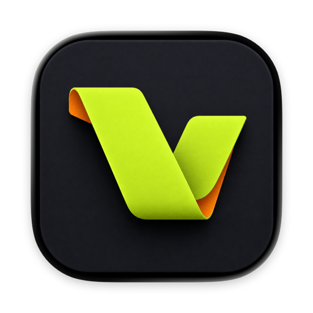

<p align="center">
  
</p>

<h1 align="center">Voke</h1>

<p align="center">
  Turn a controller into an app-aware control surface for macOS.<br>
  把手柄变成会跟随当前 App 自动切换的 macOS 控制台。
</p>

<p align="center">
  <a href="https://voke.theopcapp.com/">Website</a> ·
  <a href="https://github.com/dolphin-molt/voke/releases">Download</a> ·
  <a href="CHANGELOG.md">Changelog</a> ·
  <a href="#english">English</a>
</p>

---

## 中文

### Voke 是什么？

Voke 是一款 macOS 外设映射工具。它能把游戏手柄、外接 HID 键盘和鼠标按键变成快捷键、鼠标、滚动、App 切换或自定义命令。

Voke 不只做静态按键映射。它会识别当前前台 App，并自动切换到对应方案：进入 Codex 或 ChatGPT 时，手柄可以用来新建任务、按住说话、选择模型或处理请求；切回浏览器或其他软件，同一组按键会恢复成另一套功能。

### 适合用来做什么？

- 用手柄操作 Codex / ChatGPT 的高频动作
- 为不同 App 保存不同的控制方案，并自动切换
- 把摇杆变成鼠标移动、滚动或 App 导航
- 把外接小键盘、鼠标侧键变成自定义控制面板
- 用按键触发 macOS 快捷键、截图或可信的本地命令

### 三个核心能力

| App 自动适配 | Codex / ChatGPT | 通用 macOS 控制 |
|---|---|---|
| 根据前台 App 自动载入专属方案 | 支持任务、听写、模型选择等动作 | 快捷键、鼠标、滚动、App 切换与命令 |

### 下载与使用

1. 从 [GitHub Releases](https://github.com/dolphin-molt/voke/releases) 下载最新 DMG。
2. 把 Voke 拖入“应用程序”并打开。
3. 按应用引导开启“辅助功能”；外接 HID 键盘还需要“输入监控”。
4. 连接设备，选择一个按键，然后为它指定动作。

当前公开测试包为本地自签名、未经过 Apple 公证。首次打开时，可能需要前往“系统设置 → 隐私与安全性”选择“仍要打开”。

### 想二次开发？

项目使用 SwiftUI、GameController、IOKit HID 和 XcodeGen，最低支持 macOS 14。`project.yml` 是 Xcode 工程配置的事实来源；修改工程结构后请重新生成 `.xcodeproj`。

```bash
git clone https://github.com/dolphin-molt/voke.git
cd voke
xcodegen generate
open Voke.xcodeproj
```

常用命令：

```bash
# 自动化测试
xcodebuild test -project Voke.xcodeproj -scheme Voke \
  -destination 'platform=macOS,arch=arm64' CODE_SIGNING_ALLOWED=NO

# 安装本机测试副本
./scripts/install-local-app.sh

# 生成通用架构测试 DMG
./scripts/build-test-dmg.sh
```

代码入口：

| 位置 | 用途 |
|---|---|
| `Voke/AppModel.swift` | 应用状态与输入/输出协调 |
| `Voke/Models/` | 映射、App 动作与运行状态模型 |
| `Voke/Services/` | 手柄、HID、键鼠输出、存储与快捷键同步 |
| `Voke/Views/` | SwiftUI 界面与映射工作台 |
| `VokeTests/` | 自动化测试 |
| `site/`、`functions/` | 官网与 Cloudflare Pages Functions |

更深入的维护资料：

- [项目交接与架构说明](docs/PROJECT_HANDOFF.md)
- [真实设备与权限回归](docs/REAL_DEVICE_PERMISSION_REGRESSION.md)
- [Codex / ChatGPT 控制能力边界](docs/CODEX_CONTROL_RESEARCH.md)
- [版本变化](CHANGELOG.md) 与 [GitHub Releases](https://github.com/dolphin-molt/voke/releases)

---

<a id="english"></a>

## English

### What is Voke?

Voke is a macOS peripheral-mapping app. It turns game controllers, external HID keypads, and mouse buttons into keyboard shortcuts, pointer controls, scrolling, app switching, or trusted local commands.

Voke is app-aware rather than a static key mapper. It detects the foreground app and loads the matching profile automatically. In Codex or ChatGPT, a controller can start a task, activate push-to-talk, open the model picker, or handle a pending request. Switch back to a browser or another app, and the same controls can take on a completely different role.

### What can you use it for?

- Trigger common Codex / ChatGPT actions from a controller
- Keep a dedicated control profile for each app and switch automatically
- Use analog sticks for pointer movement, scrolling, or app navigation
- Turn a keypad or mouse side buttons into a custom control deck
- Trigger macOS shortcuts, screenshots, and trusted local commands

### Three core capabilities

| App-aware profiles | Codex / ChatGPT | General macOS control |
|---|---|---|
| Load a dedicated profile for the foreground app | Map tasks, dictation, model selection, and more | Shortcuts, pointer, scrolling, app switching, and commands |

### Download and use

1. Download the latest DMG from [GitHub Releases](https://github.com/dolphin-molt/voke/releases).
2. Drag Voke into Applications and open it.
3. Follow the in-app guide to grant Accessibility access. External HID keypads also require Input Monitoring.
4. Connect a device, select a control, and assign an action.

Public test builds are locally self-signed and not Apple-notarized. On first launch, you may need to open System Settings → Privacy & Security and choose Open Anyway.

### Building on Voke

Voke uses SwiftUI, GameController, IOKit HID, and XcodeGen, with macOS 14 as the minimum deployment target. `project.yml` is the source of truth for the Xcode project; regenerate `.xcodeproj` after changing the project structure.

```bash
git clone https://github.com/dolphin-molt/voke.git
cd voke
xcodegen generate
open Voke.xcodeproj
```

Common commands:

```bash
# Run tests
xcodebuild test -project Voke.xcodeproj -scheme Voke \
  -destination 'platform=macOS,arch=arm64' CODE_SIGNING_ALLOWED=NO

# Install the local test copy
./scripts/install-local-app.sh

# Build a universal test DMG
./scripts/build-test-dmg.sh
```

Project map:

| Path | Purpose |
|---|---|
| `Voke/AppModel.swift` | Application state and input/output coordination |
| `Voke/Models/` | Mapping, app-action, and runtime-state models |
| `Voke/Services/` | Controller/HID input, output, storage, and shortcut sync |
| `Voke/Views/` | SwiftUI interface and mapping studio |
| `VokeTests/` | Automated tests |
| `site/`, `functions/` | Landing page and Cloudflare Pages Functions |

For deeper maintenance details, see:

- [Project handoff and architecture notes](docs/PROJECT_HANDOFF.md)
- [Real-device and permission regression](docs/REAL_DEVICE_PERMISSION_REGRESSION.md)
- [Codex / ChatGPT control boundaries](docs/CODEX_CONTROL_RESEARCH.md)
- [Changelog](CHANGELOG.md) and [GitHub Releases](https://github.com/dolphin-molt/voke/releases)
